# Informatique_Graphique
The objective of this project is to implement path tracing, a sophisticated rendering technique utilized for generating lifelike images by replicating the intricate behavior of light within a three-dimensional environment. Each BE will incorporate distinct functionalities to enhance the rendering process. C++ has been selected as the programming language for its efficiency and versatility in handling complex computations required for path tracing.


# BE-0
Before making any changes, it's crucial to analyze the existing code.

These are the important features:

- The code includes two specific modules, **stb_image_write.h** and **stb_image.h**, which encompass various functionalities related to image manipulation and processing.
- **Vector class**: The Vector class represents a 3D vector that stores 3 doubles and provides methods for vector operations such as addition, subtraction, multiplication, and calculating the squared norm.
- The **main() function** initializes the width W and height H of the image and creates a vector to store the image data.
- The nested loops iterate over each pixel of the image.
- Inside the loops, it calculates the **Gaussian value** at each pixel using the formula $\exp\left(-\frac{{(\mathbf{v} - \text{center}).\text{norm2}}}{{2 \times \text{sqr}(0.2)}}\right)$, where $\mathbf{v}$ is the vector representing the current pixel position, $\text{center}$ is the center of the Gaussian distribution, and $0.2$ is the standard deviation.
- The Gaussian value is then scaled and assigned to the **red, green, and blue components** of the pixel.
- The image is saved to a PNG file using the stbi_write_png function.

This code generates an image with a Gaussian distribution, where the intensity of each pixel is determined by the Gaussian function. The resulting image will have a Gaussian-like pattern, with brighter regions near the center and fading towards the edges.

This is the image produced:

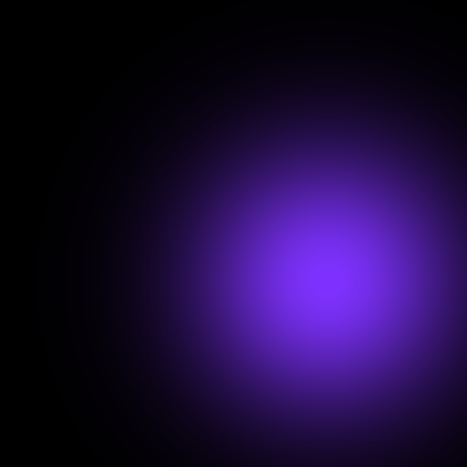

# BE-1 12/01/24

## 1.0 Intersection Ray-Sphere

First of all, we will introduce some objects, such as:

- the class **Ray**, which contains a Vector *O* for the origin of the ray and a Vector *u* to store the direction of the ray.
- The class **Sphere**, which contains a Vector *C* to save the information related to the center of the sphere and a double *R* for the radius.

Now, it is important to insert the concept of **intersection between Ray and Sphere**.

A ray, originating from point $O$ and directed along vector $\mathbf{u}$, is parametrized by $X(t) = O + t \mathbf{u}$, where $t > 0$.
On the other hand, a sphere centered at $C$ with radius $R$ is defined implicitly by the equation $\|X - C\|^2 = R^2$.

Any point of intersection $P$, if it exists, must satisfy both equations. Substituting the ray equation into the sphere equation yields $\|O + t \mathbf{u} - C\|^2 = R^2$.
Expanding the squared norm and leveraging scalar product bilinearity, we arrive at the quadratic equation:
\[t^2 + 2t\langle\mathbf{u}, O - C\rangle + \|O - C\|^2 - R^2 = 0\]

This quadratic equation yields $0$, $1$, or $2$ real solutions, depending on the discriminant $\Delta = \langle\mathbf{u}, O - C\rangle^2 - (\|O - C\|^2 - R^2)$.
Geometrically, if $\Delta < 0$, the line (not the ray) does not intersect the sphere. If $\Delta = 0$, there's a single (double) intersection, and if $\Delta > 0$, there are two intersections.
However, we need to ensure that the solution parameter $t$ is non-negative to prevent intersections behind the ray origin.

In the context of ray-tracing, only the first non-negative intersection is considered, i.e., the one closest to the ray origin.
If $\Delta \geq 0$, the possible intersection parameters are $t_1 = \langle\mathbf{u}, C - O\rangle - \sqrt{\Delta}$ and $t_2 = \langle\mathbf{u}, C - O\rangle + \sqrt{\Delta}$.
If $t_2 < 0$, the ray does not intersect the sphere. Otherwise, if $t_1 \geq 0$, $t = t_1$, otherwise $t = t_2$. The intersection point $P$ is given by $P = O + t \mathbf{u}$.

Firstly, I define a function named '**intersect**' within the class 'Sphere'. As mentioned earlier, I compute the parameters of the quadratic equation, denoted as $a$, $b$, and $c$. Then, I calculate the discriminant ($\Delta$). If it is negative, the function returns false, indicating no intersection. Otherwise, I compute both solutions, but I consider only the one closest to the origin of the ray, namely $t_2$.
By iterating over all pixels in the pixel grid, casting rays, and checking for intersections, we can determine if any intersections occur. If an intersection is found, setting the pixel to white will produce the desired image.

At the end of this section, we will obtain a white sphere on a black background. The color white is given cause of the rays from the camera that have intersections with the area defined by the sphere.

 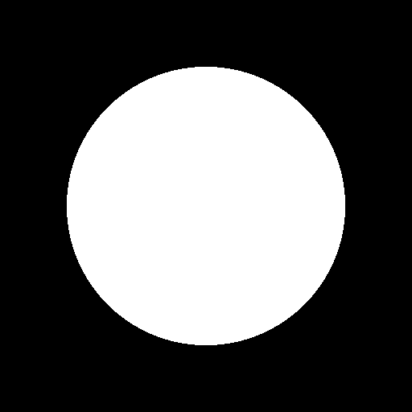


## 1.1 Enlightenment Lambertian model

The Lambertian lighting model describes how surfaces reflect light uniformly in all directions, regardless of the observer's viewpoint. A Lambertian surface is one that exhibits diffuse reflection, scattering light equally in all directions.

To achieve this, it's crucial to compute the pixel intensity when an intersection occurs. This involves considering the albedo (representing the object's color) and the light intensity, initially set at $2 \times 10^6$. Additionally, we compute the diffuse reflection using the formula:
$$
\text{std::max}\left(0, \frac{\langle \mathbf{N}, (\text{position\_light} - \mathbf{P}) \rangle}{\| \text{position\_light} - \mathbf{P} \| ^2}\right)
$$
where $\mathbf{N}$ is the surface normal, $\mathbf{P}$ is the intersection point, and ${position\_light}$ is the position of the light source. This formula ensures that negative values are clamped to zero, and it accounts for the angle between the surface normal and the vector from the intersection point to the light source position.

For further lighting computation, we also need to determine the unit normal $\mathbf{N}$ at $P$, which can be calculated as $\mathbf{N} = \dfrac{P - C}{\|P - C\|}$.

In the **intersect** function of the `Sphere` class, I have introduced two additional vectors, $\mathbf{N}$ and $\mathbf{P}$, passed by reference. This modification facilitates the computation of the normal vector $\mathbf{N}$, defined as the difference between the intersection point $\mathbf{P}$ and the center of the sphere $\mathbf{C}$.

This is the image created:

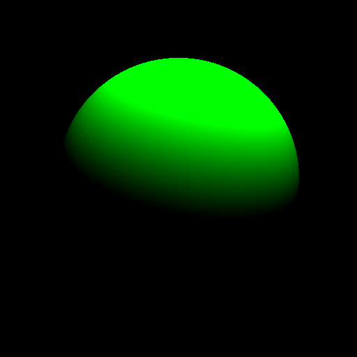

## 1.2 Scene

In this section, we'll focus on constructing the **Scene**. This class contains a vector of Spheres and includes functions to add a Sphere to the Scene and to determine if there are intersections between each Sphere and the camera rays.

The function '**intersect**' of the class Scene iterates through each object in the scene using a for loop, checking for intersections with the camera rays. If an intersection is found, it stores the ID of the object if the intersection distance is less than previously found distances. This allows us to identify the object closest to the origin of the ray.

We also need to modify the main function by adding a Scene and different spheres to construct the walls of our scene. To create the walls, we utilize large spheres to ensure intersections between them.

This is the image obtained at the end of the section:

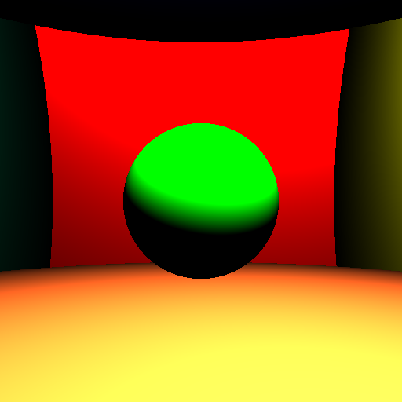
# BE-2 19/01/24
## 2.1 Shadows

In this section, we will introduce **shadowing effects**. Specifically, when an intersection occurs between the light source and the Scene, we will cast another ray. If this ray intersects with a Sphere and the distance between the sphere and the ground floor is smaller than the distance between the light source and the ground floor, we will color that pixel black. These modifications can be observed in the main function, where I added the ray *ray_light*. If an intersection occurs and the distance *t_light* (from the ray to the light) is less than *d_light_squared*, the color will be set to black, resulting in a shadow effect.

Moreover, we can incorporate **gamma correction** to enhance the precision of color intensity. This involves raising the RGB values (within a normalized range [0, 1]) to the power of $1/\gamma$, typically where $\gamma = 2.2$.

This is the result obtained: it is possible to notice the shadow beneath the central ball, extending onto the floor.

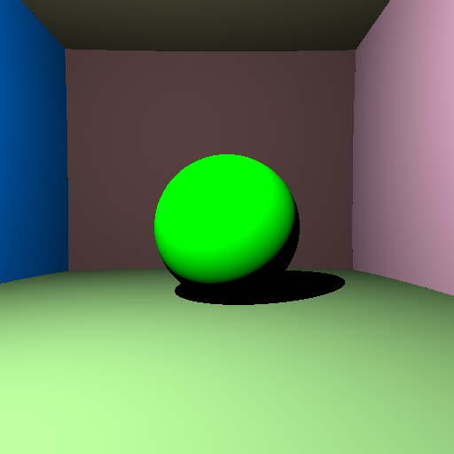

## 2.2 Mirror Surface

Unlike Lambertian surfaces, which scatter light uniformly in all directions, purely reflective or specular surfaces reflect light in a single direction. The direction of **reflection**, denoted as $\omega_r$, is determined by subtracting twice the dot product between the incident direction $\omega_i$ and the surface normal $\mathbf{N}$ from the incident direction itself: $\omega_r = \omega_i - 2\langle\omega_i, \mathbf{N}\rangle\mathbf{N}$. Essentially, a perfect mirror only redirects light energy from the incident direction to the reflected direction.

Implementing reflections becomes a crucial aspect of the path tracer. Reflective surfaces introduce recursive code: to compute the light reaching the camera sensor, we must determine the amount of light arriving at point $P$ from the reflected direction $\omega_r$. However, the light from this reflected direction may itself be the result of reflection from another mirror, and so on.

In order to implement reflection, I've developed a function called **getColor**, which is recursively invoked in the main function. This function utilizes the parameter *number_of_rebonds* to determine the number of times the direction changes. Since it's impractical to compute this infinitely, we limit the number of rebonds.

Here's how the *getColor* function operates:

- At the beginning, there's an if statement to check if *number_of_rebonds* is equal to 0. In that case, the function returns the color black (0,0,0).
- When an intersection occurs, there's another if statement to determine if the object is a mirror.
- If the object is a mirror, the direction $\omega_i$ is computed using the formula $\omega_r - 2\cdot \text{dot}(N,\omega_r) \cdot N$. Then, a new ray, *ray_mirror*, is created with this direction, and the *getColor* function is recursively called with the updated value of *number_of_rebonds* (decremented by 1).
- If the object is not a mirror, it falls under the case of diffuse surfaces (similar to the previous code).

The main function will be simplified: within the nested loop, the *getColor* function will be called only once with the chosen *number_of_rebonds*.

This is the result:

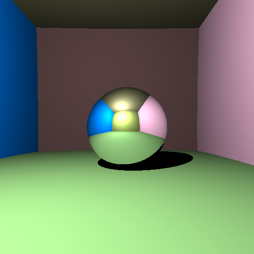


## 2.2 Transparent Surface

The behavior of **transparent surfaces** is analogous to that of mirrors, with rays continuing their trajectory after bouncing off the surface, but this time, passing through it. However, computing the direction of reflection is slightly more complex. We employ Snell's law, expressed as $n_1 \sin \theta_i = n_2 \sin \theta_t$. This law states that the tangential component of the transmitted ray ($\sin \theta_t$) is stretched relative to that of the incident ray ($\sin \theta_i$) by a factor of $n_1/n_2$.

Decomposing the transmitted direction $\omega_t$ into tangential and normal components ($\omega_{T}^{t}$ and $\omega_{N}^{t}$, respectively), we can derive that:
$$
\omega_{T}^{t} = \frac{n_1}{n_2} (\omega_i - \langle \omega_i, \mathbf{N} \rangle \mathbf{N})
$$
Where we utilize the fact that the tangential component of $\omega_i$ is obtained by subtracting its normal component (its projection onto $\mathbf{N}$).

Regarding the normal component, we have:
$$
 \omega_{N}^{t} = -\mathbf{N} \sqrt{1 - \sin^2 \theta_t}
$$
Considering the normal $\mathbf{N}$ points towards the incoming ray. This simplifies to:
$$
 \omega_{N}^{t} = -\mathbf{N} \sqrt{1 - \left(\frac{n_1}{n_2} \sin \theta_i\right)^2}
$$
The cosine term can be computed by projecting onto the normal $\mathbf{N}$, resulting in:
$$
\omega_{N}^{t} = -\mathbf{N} \sqrt{1 - \left(\frac{n_1}{n_2}\right)^2 (1 - \langle \omega_i, \mathbf{N} \rangle^2)}
$$
From this equation, one can observe that if $1 - \left(\frac{n_1}{n_2}\right)^2 (1 - \langle \omega_i, \mathbf{N} \rangle^2)$ becomes negative, the square root would yield imaginary results. This can only occur if $n_1 > n_2$. This corresponds to total internal reflection, and occurs if $\sin \theta_i > \frac{n_2}{n_1}$.

The modification to the code involves adding an if statement to handle the transparency effect inside the *getColor* function. If the object is transparent and has refractive indices $n_1$ and $n_2$, we compute the normal direction. It's important to note that if $n_1 > n_2$, the normal direction should be negated, so we take its absolute value. We then determine the tangential direction of refraction using the formula seen above. Subsequently, we create the refracted ray and call the *getColor* function again, reducing the *number_of_rebonds* parameter by 1.

In this image, you can observe both the transparency and mirror effects.


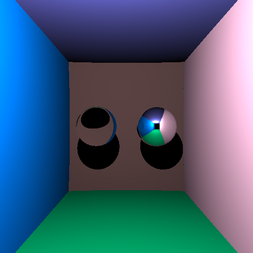

# BE-3 02/02/24
## 3.1 Indirect Illumination and Monte Carlo Integration

### The Rendering Equation

The rendering equation, governing the outgoing spectral radiance (i.e., the output of `Scene::getColor`), is expressed as follows:
$$
L_o(x, \omega_o, \lambda, t) = L_e(x, \omega_o, \lambda, t) + \int_{\Omega} f(x, \omega_i, \omega_o, \lambda, t)L_i(x, \omega_i, \lambda, t)\langle \omega_i, \mathbf{N} \rangle d\omega_i
$$
This equation specifies that the color at a point `x` in the scene, evaluated at intersection points `P`, is contingent upon various factors. These include the direction of the ray `-ω_o`, the light wavelength `λ`, and a time parameter `t`. It yields the combined effect of emitted light `L_e` at `x` in the direction `ω_o`, along with the contribution of reflected light at the same point. The reflected light at `x` comprises the sum of all incoming light contributions `L_i` from the hemisphere `Ω` incident on `x`. This summation is modulated by the Bidirectional Reflectance Distribution Function (BRDF) `f`, which characterizes the appearance or shininess of materials, and a dot product/cosine function accounting for the projected area of light sources.

A remarkable observation is that the incoming light at point `x` from direction `ω_i` equals the outgoing light at a point `x'` from direction `-ω_i`, assuming a vacuum medium. By utilizing the rendering equation at point `x'`, we can reformulate the equation previously mentioned at point `x`:
$$
L_o(x, \omega_o) = L_e(x, \omega_o) + \int_{\Omega} f(x, \omega_i, \omega_o) \left( L_e(x, \omega_o) + \int_{\Omega'} f(x', \omega_i', -\omega_i)L_i(x', \omega_i')\langle \omega_i', \mathbf{N}' \rangle d\omega_i' \right) \langle \omega_i, \mathbf{N} \rangle d\omega_i
$$
Consequently, the illumination reaching point `x'` originates from other locations in the scene, leading to a recursive process. This necessitates integration over an infinite-dimensional domain known as Path Space, representing a sum of light paths with 0, 1, 2,... ∞ bounces, which must be computed numerically.

## Bidirectional Reflectance Distribution Functions (BRDFs)

An essential component in the rendering equation is the BRDF term `f`. It quantifies the extent of light reflection from a surface toward a direction `ω_o` when it arrives from a direction `ω_i`. Conditions for their physical meaningfulness are that:

- they are positive (`f ≥ 0`);
- they respect the Helmholtz reciprocity principle, meaning they are symmetric (`f(ω_i, ω_o) = f(ω_o, ω_i)`);
- they preserve energy, meaning ∫Ω f(ω_i, ω_o)⟨ω_i, 𝐍⟩ dω_i ≤ 1, ∀ω_o.

## Monte Carlo Integration

Monte Carlo integration has emerged as a method for stochastically evaluating integrals. It is generally expressed as:

$$
\int_{\Omega} f(x) \, dx \approx \frac{1}{n} \sum_{i=1}^{n} \frac{f(x_i)}{p(x_i)}
$$


where `x_i` are random samples drawn from the probability density function `p`. This approximation converges to the true integral as the number of samples `n` tends to infinity, assuming `p > 0` wherever `f ≠ 0`. The convergence rate of this process is slow, decreasing in \( O(1/\sqrt{n}) \).

An important technique for reducing integration error is **importance sampling**. It aims to identify a probability density function `p` that closely resembles `f`. If `p` is exactly proportional to `f`, i.e., `p = αf`, then

$$
\int_{\Omega} f(x) \, dx \approx \frac{1}{n} \sum_{i=1}^{n} \frac{f(x_i)}{\alpha p(x_i)}
$$


This results in convergence without requiring any samples, achieving a \( O(1) \) convergence rate. This is because probability distributions should integrate to 1, so if they integrate to 1 and are proportional to `f`, then the constant of proportionality is the (inverse of the) integral. In essence, if an exactly proportional probability density function (pdf) can be constructed, numerical integration is unnecessary because the integral value is already known.

For now, we will assume that our surfaces are either purely diffuse with albedo `ρ` (and `L_e = 0`), or purely emissive (with `f = 0` and `L_e ≠ 0`). Our objective is to randomly sample the space of light paths, with a higher frequency in regions where the light contribution is high. This allows us to perform Monte Carlo estimation of the integral with importance sampling.

At each bounce of light over a diffuse surface at point `x`, we locally evaluate the integrand, which requires recursively tracing another ray of light that needs to be importance sampled. For the diffuse case, the rendering equation simplifies to:


$$
L_o(x, \omega_o) = \frac{\rho}{\pi} \int_{\Omega} L_i(x, \omega_i) \langle \omega_i, \mathbf{N} \rangle \, d\omega_i
$$

To perform importance sampling in this scenario, we ideally want to sample the integrand

$$
L_i(x, \omega_i) \langle \omega_i, \mathbf{N} \rangle
$$

However, as mentioned earlier, this is not straightforward (otherwise, the problem would be already solved). A simple approach is to sample only according to the second term

$$
\langle \omega_i, \mathbf{N} \rangle
$$

Assuming

$$
\mathbf{N} = (0, 0, 1)
$$

this can be achieved using a formula similar to the Box-Muller formula:

$$
\begin{aligned}
    r_1, r_2 &\sim U(0, 1) \\
    x &= \cos(2\pi r_1) \sqrt{1 - r_2} \\
    y &= \sin(2\pi r_1) \sqrt{1 - r_2} \\
    z &= \sqrt{r_2}
\end{aligned}
$$


Important modifications in the code:

In the function `getColor()`, I've added how to handle indirect illumination in this way:

- created two random numbers `r1` and `r2`;
- generated a random direction in local coordinates and a random vector in space;
- calculated two tangent vectors based on the normal and the random vector;
- combined the random local direction with the tangent vectors to obtain a random direction;
- created a ray with a slight offset from the intersection point along the normal direction;
- accumulated the color contribution from the random ray by recursively calling `getColor` function.

In the main, I've specified the `number_of_rays`. Inside the loop over `number_of_rays`, multiple rays are cast from the same pixel position \( r \), each with a slightly different direction. This introduces randomness in the sampling process, which is beneficial for reducing aliasing and noise in the final rendered image.

The color contribution from each of these rays is accumulated in the `color` variable. After casting all `number_of_rays` rays, the accumulated color is averaged by dividing by `number_of_rays`, effectively computing the average color value for that pixel.

By increasing the value of `number_of_rays`, you increase the number of samples taken per pixel, which generally leads to smoother and higher-quality rendered images. However, it also increases computational overhead, so there's often a trade-off between rendering speed and image quality.

At the end, we should see a more diffuse and less sharp image.

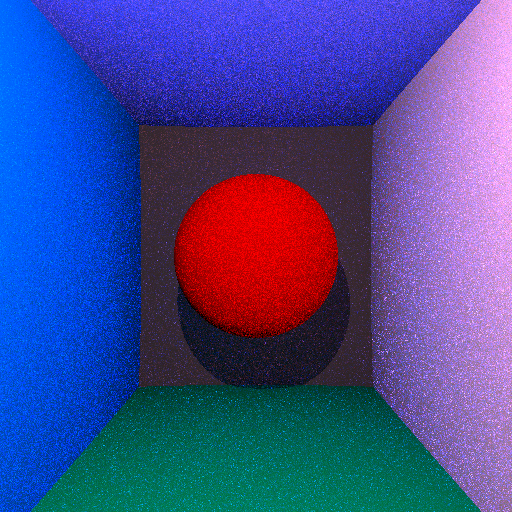

# BE-4 09/02/24
In this section, we'll see how to add the antialiasing filter, soft shadows, and depth-of-field.

### 4.1 Antialiasing Filter

In order to address the aliasing issue and enhance the precision of the rendered images, an anti-aliasing filter has been implemented. This method involves adjusting the sampling process for each pixel by assigning weights to neighboring pixels.

The Box-Muller method is employed to generate random deviations (dx and dy) for each pixel. This method utilizes uniformly distributed random numbers to generate pairs of normally distributed random numbers, which are then used to displace the pixel position.

The generated deviations (dx and dy) are applied to adjust the pixel position (u) before casting the ray. This adjustment introduces random variations in the direction of the ray, effectively mitigating aliasing effects.

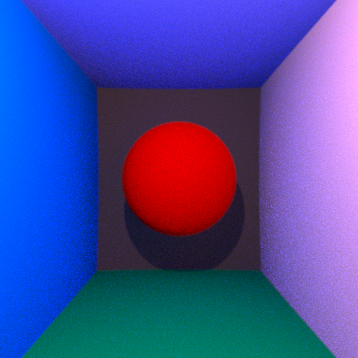

## Section4.2 Sweet Shadows
First of all, we consider the light as a sphere that is part of the Scene. Inside the getColor function, if the sphere is the sphere of light, than we will return the color of the light divided by the area of the sphere. The result is an image full of noise.


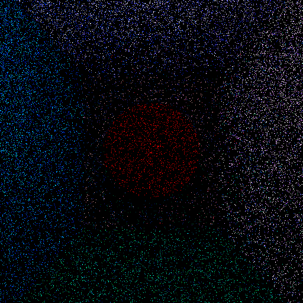

Using a bigger sphere for the light, it is possible to notice less noise in the image.
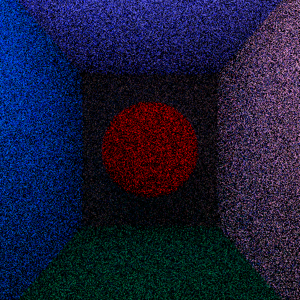

After that, we introduce the concept of soft shadows. We separate the hemisphere of integration into two parts: the direct contribution is the one of the light source projection, the rest of the hemisphere is for indirect. We re-parametrize the rendering equation via a change of variable. Thus, we have to compute the determinant and the normal of the area patch. We create a new function called `random_cos`, that returns a random Vector that has more chances of being sampled around `N` than orthogonally to it. Inside the function `getColor`, we do other changes, mostly for the direct enlightenment.

**Result:** With respect to the previous one, it is possible to see less noise.

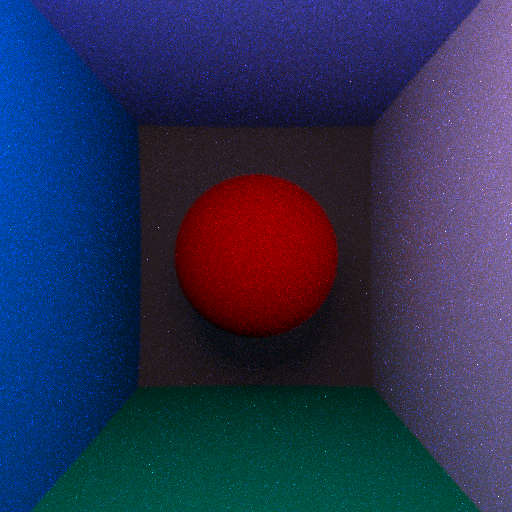

## Section 4.3 Depth of field
Due to the fact that the generated images are sharp at all distances, we will implement the depth of field: in this way all the points at the focus distance should describe a plane where points project to points on the sensor and remain sharp, and light passes through the aperture before reaching the lens.
It is possible to notice that there is more deep in the image, that gives a certain sense of perspective.

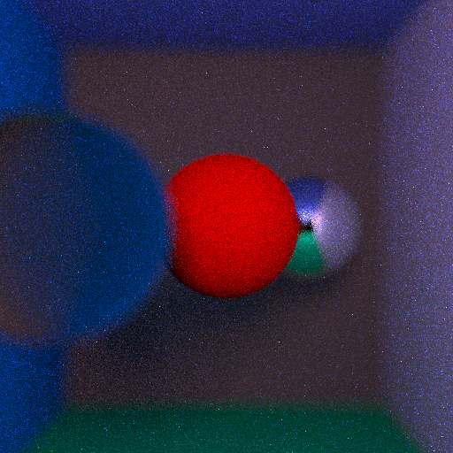

# BE-5 16/02/24

In this section we will se the following steps:
- intersection ray-plan, ray triangle
- ray bounding box
- bounding volume hierarchies
- Phong smoothing

## Section 5.1
In this first section our aim is to introduce the class 'Triangle' and perform the intersection ray-triangle. In order to make our objects as general as possible, we create also another Class, called 'Object', that contains the parameters that Triangle and Sphere have in common, in other words the parameter is_transparent, is_mirror, albedo. In order to compute the intersection between the traingle and the ray, due to the fact that the traingle is made of 3 points, it is necessary to compute the parameters of the matrices that represents the different distances between the points of the triangle and the intersection point. For this reason, we use Cramer methode, so we compute the determinant of the matrices to solve the system equations. At the end, in the main part, we also create and add the object t1 that represent our first Triangle. This is the result:

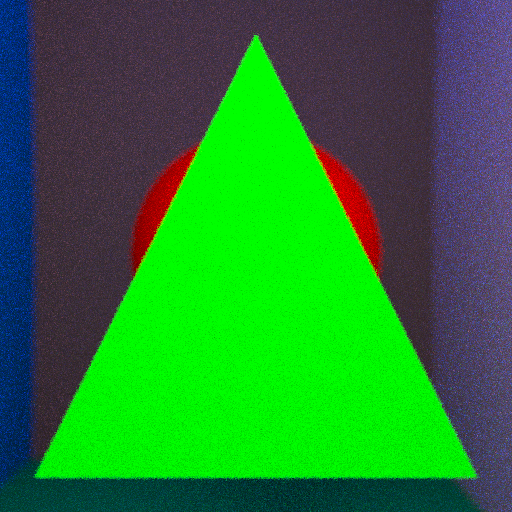
## Section 5.2
## Section 5.3
## Section 5.4

# BE-6 23/02/24
```cpp


```